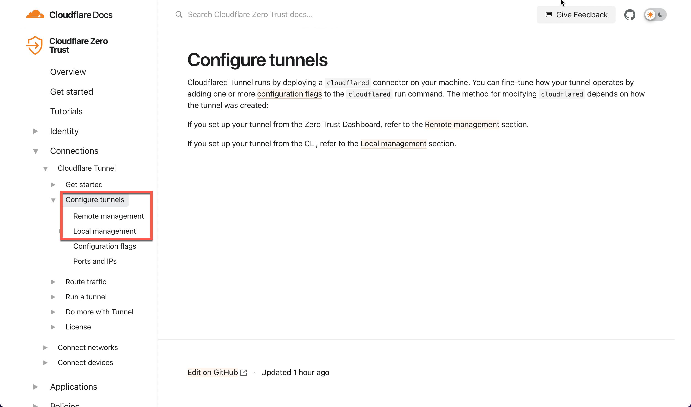

# Cloudflare local vs. remote managed tunnels

## About

Check the following information if you are unsure which tunnel type to use
with this add-on.

In general you can use both tunnel types (remote or local) with this add-on.

If you like to configure your tunnel from within the add-on configuration page
and are happy with the given options, the local tunnel is what you are looking
for. Take a look at the [add-on docs](../cloudflared/DOCS.md), to see what
options can be used.

If you want to set up a more sophisticated tunnel with full flexibility and
maintain it from the Cloudflare Zero Trust Dashboard, you should go for the
remote managed tunnel. Have a look at this [how-to](remote-tunnel.md).

Keep in mind, when using remote tunnels, you will need to configure all hosts
(including Home Assistant) by yourself.

## Cloudflare Documentation

Revise the [official Cloudflare documentation][cloudflare-docs]
to see latest information.

[cloudflare-docs]: https://developers.cloudflare.com/cloudflare-one/connections/connect-apps/configuration/
